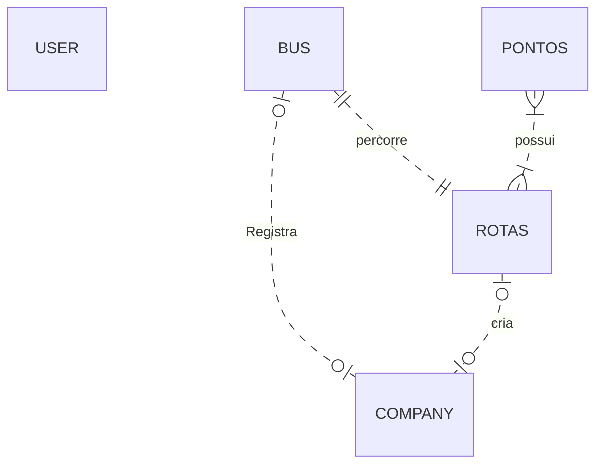
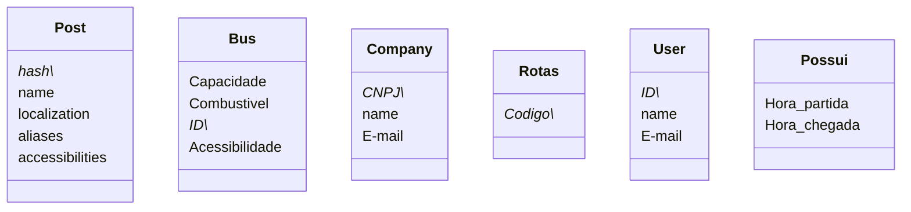

<!--MERMAID {width:100}-->

<!--MCONTENT {content: "erDiagram \nUSER \nBUS |o..o| COMPANY : Registra \nROTAS |o..o| COMPANY : cria \nBUS ||..|| ROTAS : percorre \nPONTOS }|..|{ ROTAS : possui \n "} --->

 

<!--MERMAID {width:100}-->

<!--MCONTENT {content: "classDiagram \nclass Post { \nhash\\* \nname \nlocalization \naliases \naccessibilities \n} \nclass Bus { \nCapacidade \nCombustivel \nID\\* \nAcessibilidade \n} \nclass Company { \nCNPJ\\* \nname \nE-mail \n} \nclass Rotas { \nCodigo\\* \n} \nclass User { \nID\\* \nname \nE-mail \n} \nclass Possui { \nHora\\_partida \nHora\\_chegada \n}"} --->

 

This file was generated by Swimm. [Click here to view it in the app](https://app.swimm.io/repos/Z2l0aHViJTNBJTNBbWVyY3VyaXVzJTNBJTNBQ3lydXNpdW0=/docs/g1wc0vd3).
